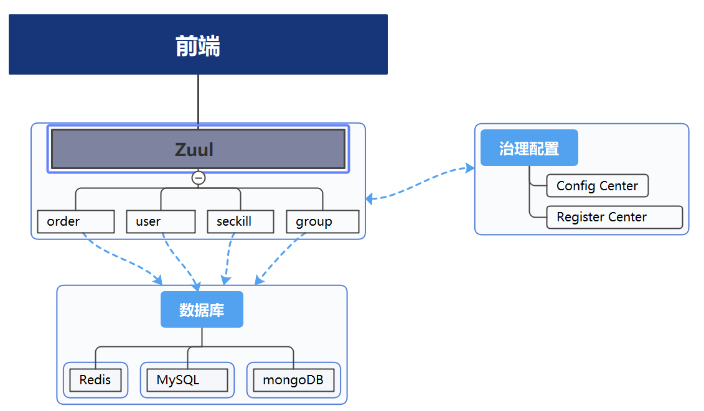

# README
### Introduction
本项目是“交我团”团购平台的微服务架构版本后端，采用了`spring cloud`框架，项目的架构可以参考下图, zuul实现路由动态转发和过滤功能，四个微服务负责具体的逻辑处理，register center实现服务的注册和发现，config center实现配置的集中管理。项目具体实现的功能详见`Group-Purchase-mobile-frontend`的`README`。

* 启动的各个端口
  
  此外，zuulserver运行在`8080`端口，configcenter运行在`8762`端口
* 启动时需要将JDK换成1.8
* 启动eureka-server, 访问`http://localhost:8761/`可打开注册中心


### 运行
* 下载项目
  ```shell
  git clone https://github.com/ZhaoHaoRu/Group-Purchase-Microservices-Architecture-Backend.git
  cd groupbuy_cloud
  ```
* 修改数据库的密码、用户名等信息。在修改配置文件时，直接在`configserver/src/main/resources/shared`文件夹下修改module名对应的文件
* 对于各个`module`进行
* 依次启动`registercenter`, `configserver` `user`, `order`, `group`, `seckill` 和`zuulserver`
* 在`8080`端口访问接口

  
### zuul进行过滤的基本原理

目前实现的功能：
对于login, changeGroup, addOrder, 删除团购并退款在网关进行过滤，使用token进行比对 

### 服务器部署
服务器部署有两个版本：docker-compose版本和K8S（一主一从服务器）版本
首先在microservice文件夹地址中，从我的阿里云镜像库中下载对应镜像：
1.registercenter：registry.cn-hangzhou.aliyuncs.com/dongyunpeng/registercenter
2.clientfeign：registry.cn-hangzhou.aliyuncs.com/dongyunpeng/clientfeign
3.order：registry.cn-hangzhou.aliyuncs.com/dongyunpeng/order
4.seckill：registry.cn-hangzhou.aliyuncs.com/dongyunpeng/seckill
5.user：registry.cn-hangzhou.aliyuncs.com/dongyunpeng/user
6.zuulserver：registry.cn-hangzhou.aliyuncs.com/dongyunpeng/zuulserver
7.group：registry.cn-hangzhou.aliyuncs.com/dongyunpeng/group

第一版本：docker-compose对应的compose.yml文件在/src文件夹下，cp到/microservice中执行。
第二版本：一主一从两台服务器部署K8S，并分别下载kuboard的GUI版本，进入masker服务器对应8377端口。
之后在主节点新建default命名空间，之后在命名空间中加载私有库中的镜像
最后运行镜像，构成网关层-微服务层-持久层的架构。

### About
如果对于项目有任何问题的话，欢迎提交issue或者与我们联系。

