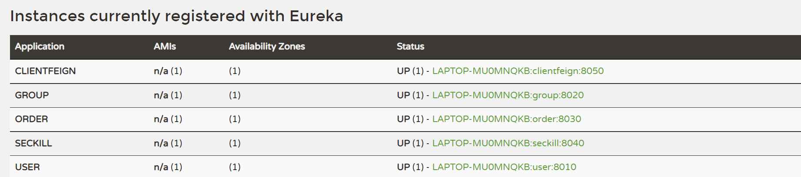
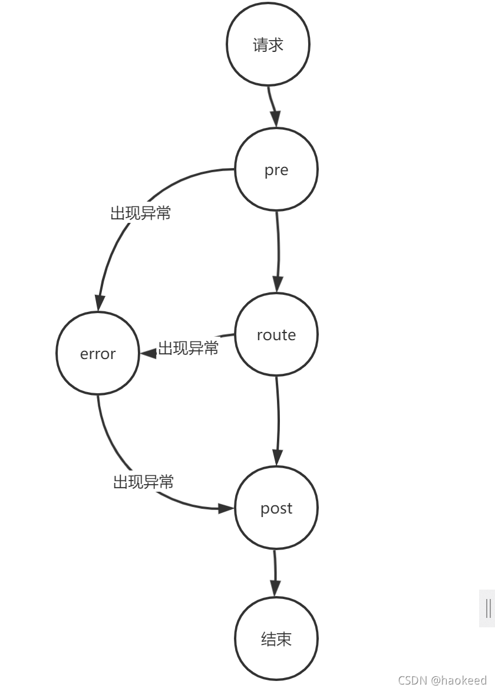

# 微服务架构
* 启动的各个端口
  
* 启动时需要将JDK换成1.8
* 启动eureka-server,访问`http://localhost:8761/`打开注册中心

## 测试接口问题
* 有的时候不行，有的时候就行了
- [x] createGroup(太慢了，911ms)
- [ ] endGroup(返回200 OK, 但是数据库没有改)
- [x] recommend

## version2.0：zuul实现网关
### 运行
* 依次启动`registercenter`, `user`, `order`, `group`, `seckill` 和`zuulserver`
* `zuulserver`运行在8080端口，测试用例详见附属文件
* 切记更换数据库名称和密码以及运行rabbitmq和redit
* 数据库记得更改名字

  
### zuul进行过滤的基本原理

目前实现的功能：
对于login, changeGroup, addOrder, 删除团购并退款在网关进行过滤，使用token进行比对 

### 安全加密：使用https进行前后端交互
* 不成立，zuul不支持

## version 3.0 加入config server
### 运行
* 依次启动`registercenter`, `configserver` `user`, `order`, `group`, `seckill` 和`zuulserver`
* 在修改配置文件时，直接在`configserver/src/main/resources/shared`文件夹下修改module名对应的文件

## version 4.0
？？？
